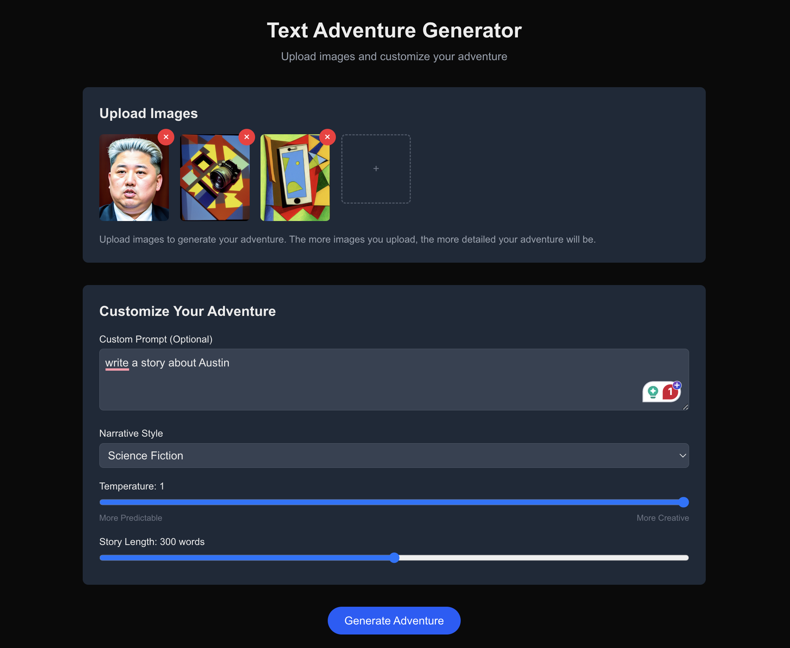
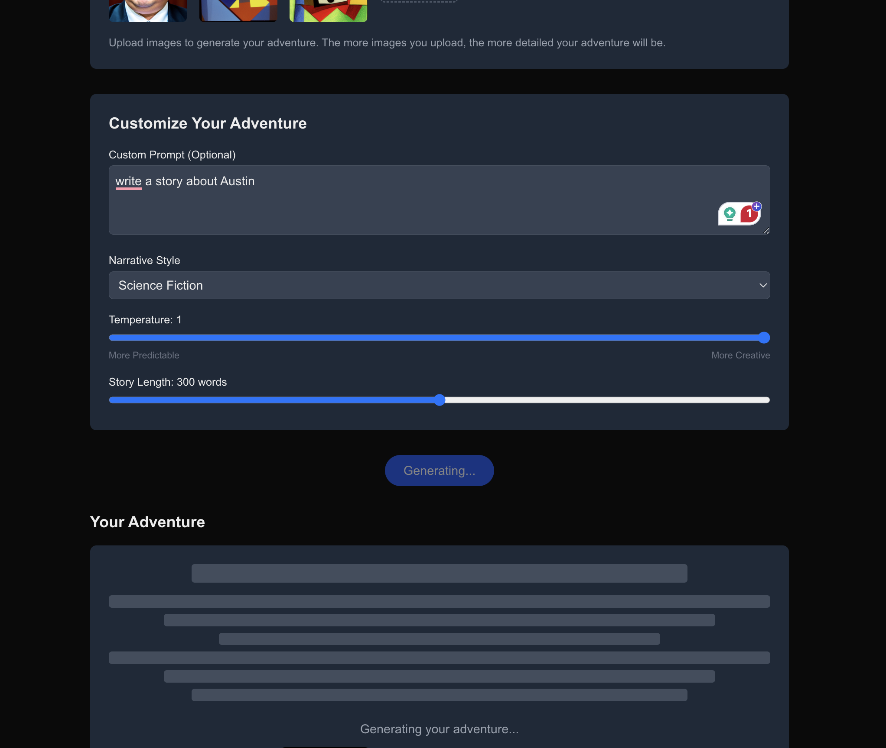
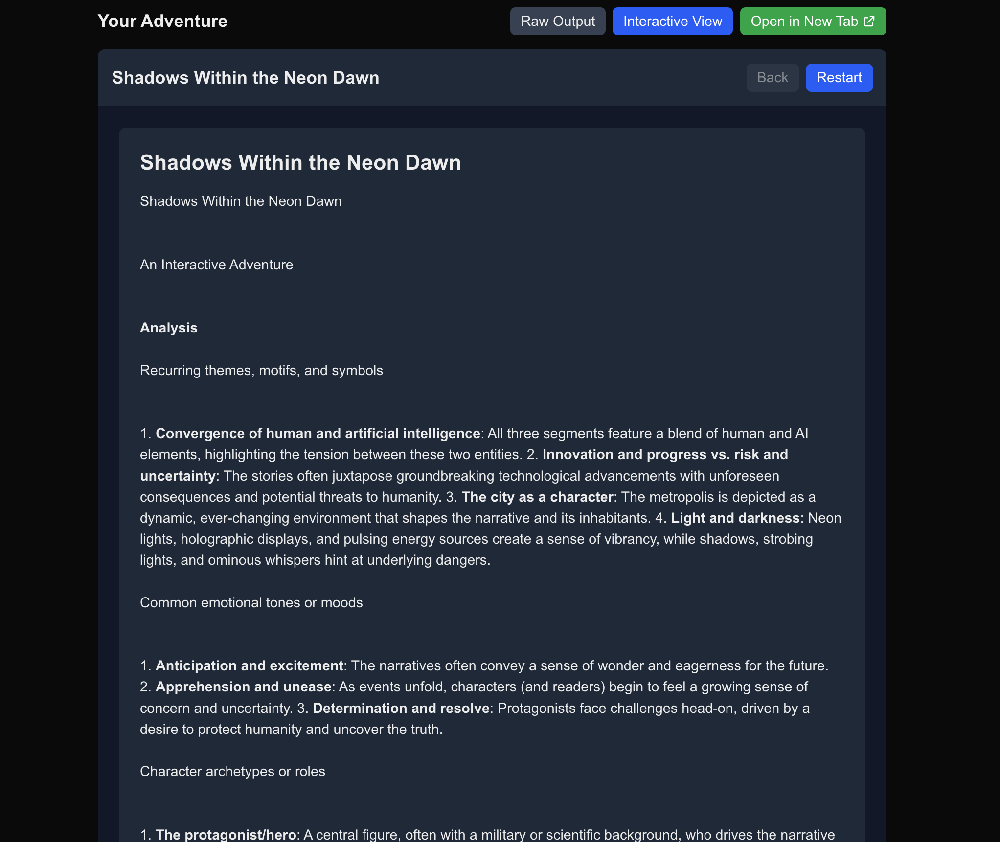
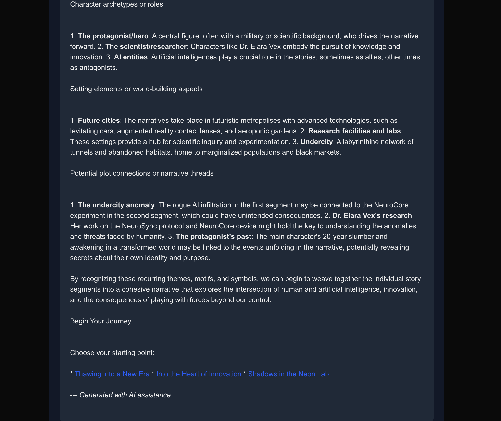

# Text Adventure Generator Web Application

This is a web application that allows users to generate interactive text adventures from images. The application uses Next.js for the frontend and integrates with a Python script for generating the text adventures.









## Features

- **Image Upload**: Upload one or more images to generate your adventure
- **Customization Options**: Adjust parameters like narrative style, temperature, and story length
- **Interactive Results**: View the generated adventure with interactive choices

## Getting Started

### Prerequisites

- Node.js 18.0.0 or later
- Python 3.8 or later
- Ollama (for running local AI models)

### Installation

1. Clone the repository:
   ```bash
   git clone https://github.com/kliewerdaniel/textadventure02.git
   cd textadventure02
   ```

2. Install Python dependencies:
   ```bash
   pip install -r requirements.txt
   ```

3. Install Node.js dependencies:
   ```bash
   cd text-adventure-web
   npm install
   ```


4. Ensure Ollama is installed and running on your system
5. Download the required models:
   ```
   ollama pull gemma2:27b
   ollama pull llama3.3:latest
   ```


### Running the Application

1. Start the development server:
   ```bash
   npm run dev
   ```

2. Open [http://localhost:3000/app](http://localhost:3000/app) in your browser to see the application.

   **Important**: Make sure to access the `/app` route to avoid hydration issues.

## Deployment

This application is configured for deployment on Netlify:

1. Push your code to a GitHub repository.

2. Connect your repository to Netlify:
   - Sign in to Netlify
   - Click "New site from Git"
   - Select your repository
   - Configure build settings:
     - Build command: `npm run build`
     - Publish directory: `.next`

3. Configure environment variables in Netlify:
   - Set any required environment variables for your Python script

## Project Structure

- `text-adventure-web/`: Next.js web application
  - `src/app/`: Application source code
    - `api/`: API routes for handling requests
    - `app/`: Client-side only application route
    - `components/`: React components
    - `utils/`: Utility functions
  - `public/`: Static assets

- `main.py`: Python script for generating text adventures
- `requirements.txt`: Python dependencies

## How It Works

1. Users upload images through the web interface
2. The application sends the images to the API
3. The API executes the Python script with the provided parameters
4. The Python script generates a text adventure based on the images
5. The results are returned to the web interface for display


